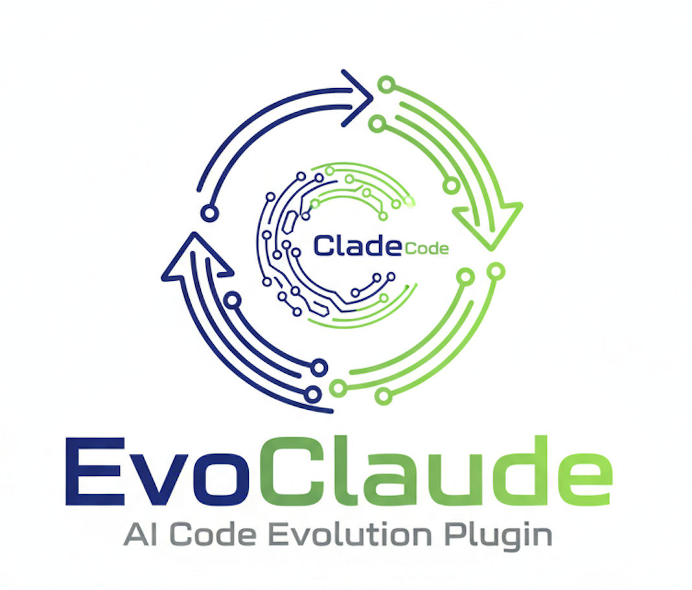

<h1 align="center">
  <a href="https://github.com/L-Qun/EvoClaude">
    
  </a>
</h1>

<h4 align="center">面向 <a href="https://claude.com/claude-code" target="_blank">Claude Code</a> 的智能体自我进化插件</h4>

<p align="center">
  <a href="README.md">🇺🇸 English</a>
</p>

<p align="center">
  <a href="LICENSE">
    
  </a>
  <a href="package.json">
    
  </a>
  <a href="package.json">
    
  </a>
</p>

<p align="center">
  <a href="#为什么做-evoclaude">为什么 EvoClaude</a> •
  <a href="#快速开始">快速开始</a> •
  <a href="#工作原理">工作原理</a> •
  <a href="#配置说明">配置说明</a> •
  <a href="#开发指南">开发指南</a> •
  <a href="#许可证">许可证</a>
</p>

<p align="center">
  EvoClaude 让 Claude Code 智能体能够从经验中学习，并从你的工作流模式中自动生成可复用的技能。使用越久，它就越智能。
</p>

---

## 为什么需要 EvoClaude？

在使用 Claude Code 一段时间后，你可能会发现过去的经验没办法在下一轮任务中被复用，Claude Code 仍然一直在犯相同的错误。EvoClaude 通过 Agent Skills 技术让 Claude Code 智能体能够从经验中学习并持续改进。我们相信 Agent Skills 是让 Agent 自进化的正确答案！

## 快速开始

在终端中启动新的 Claude Code 会话，然后输入以下命令：

```
/plugin marketplace add L-Qun/EvoClaude

/plugin install evoclaude
```

重启 Claude Code。EvoClaude 将自动开始从你的会话中学习。

**核心特性：**

- 🧠 **自动学习** - 从你的 Claude Code 会话中捕获模式
- 🛠️ **技能生成** - 从发现的模式自动创建可复用技能
- 📈 **渐进改进** - 随着经验积累变得更智能
- 🔍 **模式发现** - 识别重复的工作流和工具组合
- ⚙️ **完全可配置** - 对学习行为进行精细控制
- 🚀 **零配置** - 开箱即用，使用合理的默认设置

---

## 工作原理

EvoClaude 在两个简单的阶段中学习你的会话：

### 1. 收集阶段

每次会话，EvoClaude 会捕获并按天存储会话数据：

- 你的提示和指令
- 使用的工具（Read、Edit、Grep、Bash 等）
- 操作的序列
- 结果和输出

会话按日期组织：`~/.evoclaude/sessions/YYYY-MM-DD.json`

### 2. 技能生成阶段

触发时（每天或手动）：

1. **分析** 当天的会话，寻找可复用的模式
2. **生成** 符合官方 Claude Skills 格式的技能
3. **合并** 与现有技能，去重
4. **打包** 生成 `.skill` 文件，可直接使用

### 工作流示例

如果你今天处理了错误处理相关任务，EvoClaude 会：

1. **收集** 今天所有错误处理相关的任务
2. **分析** 你使用的方法和模式
3. **生成** `error-handler` 技能，遵循官方格式
4. **合并** 到现有技能中（避免重复）
5. **在所有未来的会话中可用**

---

## 配置说明

### 设置文件

编辑 `~/.evoclaude/config.json` 来自定义行为：

```json
{
  "skillLanguage": "auto",
  "skillsOutputDir": "project"
}
```

### 配置选项

#### `skillLanguage` (枚举)
- 生成技能内容的语言
- **默认值**: `"auto"`
- **可选值**:
  - `"auto"` - 自动从会话提示中检测语言
  - `"en"` - 始终使用英语生成技能
  - `"zh"` - 始终使用中文生成技能

#### `skillsOutputDir` (枚举)
- 技能保存位置
- **默认值**: `"project"`
- **可选值**:
  - `"project"` - 保存到项目目录 (`./project/.claude/skills`)
    - 推荐用于：项目专用技能、团队特定工作流
  - `"global"` - 保存到用户主目录 (`~/.claude/skills`)
    - 推荐用于：跨所有项目共享的个人技能

### 数据位置

```
~/.evoclaude/
├── config.json           # 你的配置
├── sessions/
│   ├── 2026-02-17.json   # 今天的会话数据
│   └── 2026-02-16.json   # 之前的日期数据
└── generated/
    └── temp/             # 临时生成的技能

# 技能输出位置（基于 skillsOutputDir 设置）：
./.claude/skills/         # 项目专用技能（默认）
~/.claude/skills/         # 全局技能（备选）
```

---

## 系统要求

- **Node.js**: 18.0.0 或更高版本
- **Claude Code**: 支持插件的最新版本
- **操作系统**: macOS、Linux 或 Windows

---

## 开发指南

### 快速上手

如果你想贡献或修改插件：

```bash
# 克隆仓库
git clone https://github.com/L-Qun/EvoClaude.git
cd EvoClaude

# 安装依赖
pnpm install

# 构建插件
pnpm run build

# 创建符号链接到 Claude 插件目录
ln -s $(pwd) ~/.claude/plugins/evoclaude
```

### 可用脚本

- `pnpm run build` - 构建插件
- `pnpm run lint` - 使用 Biome 检查代码
- `pnpm run lint:fix` - 自动修复代码问题
- `pnpm run format` - 使用 Biome 格式化代码
- `pnpm run check` - 运行所有检查（lint + format）

### 项目结构

```
EvoClaude/
├── .claude-plugin/         # 插件清单
├── plugin/                 # 插件入口
├── src/                    # 源代码
│   ├── anthropic-client.ts     # Agent SDK 集成
│   ├── collect.ts              # Collect hook
│   ├── config.ts               # 配置管理
│   ├── post-tool-use.ts        # Post-tool-use hook
│   ├── session-collector.ts    # 会话收集
│   ├── skill-generator.ts      # 技能生成
│   ├── skill-merger.ts         # 技能合并
│   ├── types.ts                # 类型定义
│   └── user-prompt-submit.ts   # User prompt submit hook
├── package.json
└── tsconfig.json
```

---

## 故障排除

### 技能没有出现？

**可能原因：**

- 收集的会话数据不足
- 今天的会话中没有检测到清晰的模式
- 技能生成提示词返回空结果

**解决方案：**

- 验证你是否进行了足够的会话（检查 `~/.evoclaude/sessions/`）
- 查看 `plugin/logs/` 中的任何错误
- 只有检测到清晰可复用的模式时才会生成技能

### 插件无法加载？

**解决方案：**

- 确保已安装 Node.js >= 18.0.0
- 验证插件在 `~/.claude/plugins/` 中正确链接
- 检查 Claude Code 是否为最新版本
- 查看 `plugin/logs/` 中的错误消息

---

## 架构设计

### 核心组件

1. **会话收集器** - 捕获并按天存储会话数据到 `~/.evoclaude/sessions/YYYY-MM-DD.json`
2. **技能生成器** - 使用 prompt engineering 分析每天的会话并生成技能
3. **技能合并器** - 合并新技能与现有技能，去除重复
4. **技能打包器** - 将技能打包成 `.skill` 文件用于分发

### 数据流

```
会话 → 收集器 → 按天存储 (2025-02-16/)
                  ↓
           技能生成（触发）
                  ↓
        生成技能 → temp/
                  ↓
        合并去重 → 技能输出目录
                  ↓
        打包 → .skill 文件
```

### 目录结构

```
~/.evoclaude/
├── config.json           # 你的配置
├── sessions/
│   ├── 2026-02-17.json   # 今天的会话数据
│   └── 2026-02-16.json   # 之前的日期数据
└── generated/
    └── temp/             # 临时生成的技能
        ├── skill-1/
        │   └── SKILL.md
        └── skill-2/
            └── SKILL.md

# 技能输出目录（根据 skillsOutputDir 配置）：
./.claude/skills/         # 项目模式（默认）
├── error-handler/
│   └── SKILL.md
└── component-creator/
    └── SKILL.md

# 或

~/.claude/skills/         # 全局模式
├── error-handler/
│   └── SKILL.md
└── component-creator/
    └── SKILL.md
```

---

## 贡献指南

欢迎贡献！请遵循以下步骤：

1. Fork 本仓库
2. 创建功能分支 (`git checkout -b feature/amazing-feature`)
3. 进行更改并添加测试
4. 确保代码通过检查 (`npm run check`)
5. 提交更改 (`git commit -m 'Add amazing feature'`)
6. 推送到分支 (`git push origin feature/amazing-feature`)
7. 开启 Pull Request

### 开发指南

- 遵循现有代码风格
- 为新功能添加测试
- 更新相关文档
- 保持更改聚焦和原子化

---

## 许可证

本项目采用 **MIT 许可证**。

Copyright (c) 2025 Lincoln. All rights reserved.

详见 [LICENSE](LICENSE) 文件。

**这意味着：**

- 你可以自由使用、修改和分发本软件
- 你可以在商业项目中使用
- 许可证包含免责声明
- 感谢署名但非必需

---

## 支持

- **文档**: [README](README.md) | [中文文档](README.zh.md)
- **问题反馈**: [GitHub Issues](https://github.com/L-Qun/EvoClaude/issues)
- **仓库**: [github.com/L-Qun/EvoClaude](https://github.com/L-Qun/EvoClaude)
- **作者**: Lincoln ([@L-Qun](https://github.com/L-Qun))

---

**用心构建** | **Powered by Claude Code** | **Made with TypeScript**
